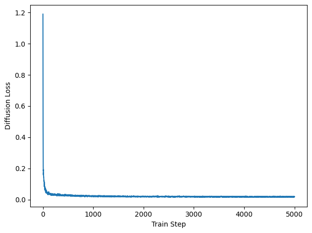
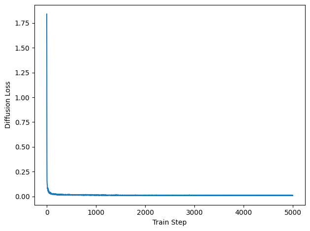
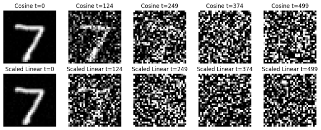
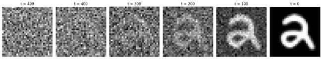
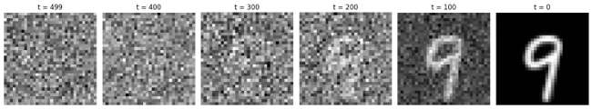
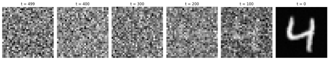
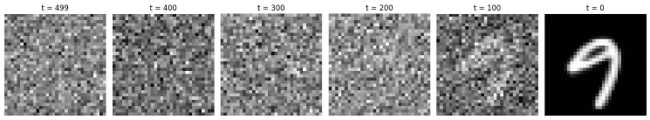

[README.md](https://github.com/user-attachments/files/28704459/README.md)
# DDPM Image Generation on MNIST

A PyTorch implementation of a **Denoising Diffusion Probabilistic Model (DDPM)** trained on the MNIST handwritten digit dataset. This project demonstrates the full diffusion workflow: adding noise to images during the forward process, training a UNet model to predict noise, and generating digit-like images through reverse denoising from random Gaussian noise.

## Overview

Diffusion models generate data by learning how to reverse a gradual noising process. In this project, MNIST digit images are resized to `32 × 32`, progressively corrupted with Gaussian noise, and then denoised using a timestep-conditioned UNet model.

The project includes:

- Forward diffusion visualization on MNIST digits
- Reverse denoising visualization from random noise
- UNet model with timestep conditioning
- DDPM noise prediction training objective
- Experiments with cosine and scaled-linear beta schedules
- Training loss plots
- Generated MNIST-like image samples

## Example Results

### Training Loss: Cosine Schedule

The cosine schedule training loss decreased quickly and stabilized, showing that the UNet learned to predict the noise added during the diffusion process.



### Training Loss: Scaled-Linear Schedule

The scaled-linear schedule was also tested to compare how a different beta schedule affected training and reverse denoising.



### Forward Diffusion Process

The forward process starts with a real MNIST digit and gradually adds Gaussian noise until the image becomes mostly noise.



### Reverse Denoising: Cosine Schedule

The reverse process starts from random Gaussian noise and uses the trained UNet model to progressively denoise the image into a digit-like sample.



A second cosine-schedule reverse sample is shown below.



### Reverse Denoising: Scaled-Linear Schedule

The scaled-linear beta schedule was also tested to compare how the noise schedule changes the denoising behavior.



A second scaled-linear reverse sample is shown below.



## Model Architecture

The denoising network is a 2D UNet conditioned on diffusion timestep values. The model receives a noisy image `x_t` and timestep `t`, then predicts the noise component added to the original image.

The model learns the function:

```text
epsilon_theta(x_t, t) ≈ epsilon
```

where:

- `x_t` is the noisy image at timestep `t`
- `t` is the diffusion timestep
- `epsilon` is the true Gaussian noise added to the image
- `epsilon_theta` is the model's predicted noise

The training objective is mean squared error:

```text
MSE(predicted_noise, true_noise)
```

## Diffusion Process

### Forward Process

During the forward process, Gaussian noise is gradually added to an original image. At later timesteps, the image becomes increasingly noisy until it approaches random noise.

The forward process is controlled by a beta schedule, which determines how much noise is added at each timestep.

### Reverse Process

During reverse sampling, the model starts from pure random noise and repeatedly applies the learned denoising model to generate an image.

The reverse process uses the trained UNet to estimate the noise at each timestep and remove it step by step.

## Experiments

The project compares two beta schedules:

- Cosine schedule
- Scaled-linear schedule

The experiments include:

- Training loss tracking
- Forward diffusion visualization
- Reverse denoising visualization
- Qualitative comparison of generated MNIST-like images

Example settings used:

```text
Dataset: MNIST
Image size: 32 × 32
Model: UNet
Timesteps: 500
Batch size: 128–256
Optimizer: Adam
Loss: Mean squared error noise prediction loss
```

## Key Takeaways

Changing the beta schedule affected how quickly images became noisy during the forward process and how stable the reverse generation process appeared. The cosine schedule produced smooth corruption and denoising behavior in these experiments, while the scaled-linear schedule changed the rate at which noise dominated the image.

Increasing the number of diffusion timesteps gives the model a more gradual denoising path, but it also increases sampling time. One important implementation detail is that the training configuration and reverse sampling configuration must match. A model trained with a cosine schedule should be sampled with the cosine schedule, and a model trained with a scaled-linear schedule should be sampled with the scaled-linear schedule.

The biggest implementation challenge was keeping the training schedule, timestep count, model checkpoint, and reverse sampling script consistent.

## Repository Structure

```text
ddpm-mnist-image-generation/
│
├── README.md
├── requirements.txt
├── .gitignore
│
├── src/
│   ├── train.py
│   ├── UNet.py
│   ├── forward_process.py
│   └── reverse_process.py
│
└── assets/
    ├── forward_mnist.png
    ├── loss_cosine_500.png
    ├── loss_scaled_linear_500.png
    ├── reverse_mnist_cosine1.png
    ├── reverse_mnist_cosine2.png
    ├── reverse_mnist_scaled_linear1.png
    └── reverse_mnist_scaled_linear2.png
```

## Installation

Create a Python environment and install the dependencies:

```bash
pip install -r requirements.txt
```

Required packages:

```text
torch
torchvision
matplotlib
numpy
scikit-learn
einops
```

## How to Run

### Train the Model

```bash
python src/train.py
```

This trains the UNet DDPM model on MNIST and saves the model checkpoint and training loss plot.

Example outputs:

```text
model.pt
loss.png
```

### Run the Forward Diffusion Visualization

```bash
python src/forward_process.py
```

This creates an image showing a real MNIST digit being progressively corrupted by noise.

Example output:

```text
forward_mnist.png
```

### Run the Reverse Denoising Visualization

```bash
python src/reverse_process.py
```

This starts from random Gaussian noise and uses the trained model to generate a digit-like image.

Example output:

```text
denoise_mnist.png
```

## Important Notes

The reverse sampling configuration must match the training configuration.

For example, if the model was trained with:

```python
timesteps = 500
beta_schedule = "cosine"
```

then the reverse sampling script should also use:

```python
timesteps = 500
beta_schedule = "cosine"
```

A model trained with a cosine schedule should not be sampled using a scaled-linear schedule unless it was trained with that schedule. The timestep count should also match between training and reverse sampling.

Large model checkpoint files are not included in this repository. The repository focuses on the implementation, experiment setup, and visual results.

## Skills Demonstrated

- Deep learning with PyTorch
- Generative AI fundamentals
- Diffusion model implementation
- UNet architecture
- Timestep conditioning
- Image generation
- Training loss analysis
- Experiment comparison
- Scientific visualization with Matplotlib
- GPU-based model training

## Future Improvements

Possible future improvements include:

- Training for more steps
- Saving multiple generated samples per run
- Adding command-line arguments for schedule, batch size, and timesteps
- Adding checkpoint loading and experiment naming
- Comparing additional beta schedules
- Improving the UNet architecture
- Training on larger image datasets
- Creating a Colab notebook for easier reproduction
- Adding experiment tracking with TensorBoard or Weights & Biases

## Academic Integrity Note

This repository is presented as a cleaned portfolio case study. Course-specific instructions, private assignment materials, and unnecessary homework files are not included.
